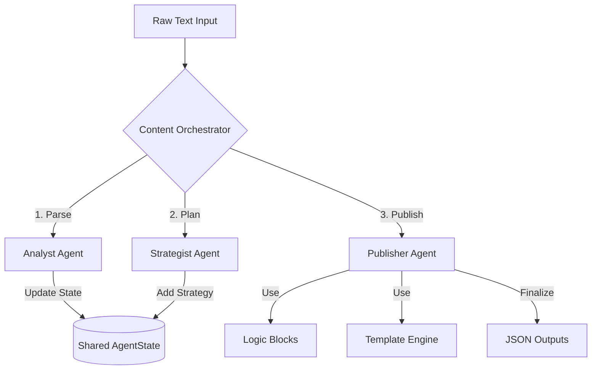

Here is the complete content for your `README.md` file. You can copy this entire block and paste it directly into your `README.md` file.

```markdown
# Kasparro AI Agentic Content System

**Author:** Ashutosh Kumar
**Role:** Applied AI Engineer Challenge Submission

## 📖 Project Overview
This project is a modular, multi-agent automation system designed to transform unstructured product data into structured, machine-readable content pages (FAQ, Comparison, Product Page). 

Unlike simple linear scripts, this system utilizes a **State-Based Orchestration Architecture**. It features independent agents for parsing, strategizing, and publishing, all coordinated by a central Orchestrator. The system is designed with production-grade reliability, including a circuit breaker pattern to handle API outages gracefully.

## 🚀 Key Features
* **Multi-Agent Architecture**: Decoupled `Analyst`, `Strategist`, and `Publisher` agents with distinct responsibilities.
* **State Management**: Uses Pydantic models (`AgentState`) to ensure type safety and consistent data flow between agents.
* **Template Engine**: A custom `BaseTemplate` engine that enforces strict JSON schemas for all output pages.
* **Deterministic Logic Blocks**: Python-based rules engine for safety warnings and mathematical ingredient comparisons (reducing LLM hallucination risks).
* **Resilience & Fault Tolerance**: Includes an automatic **Offline Fallback Mode**. If the AI API is rate-limited (HTTP 429) or down, the system seamlessly switches to structured mock data to ensure pipeline completion.

## 🛠️ System Architecture



## 📂 Project Structure

```text
kasparro-ai-agentic-content-system/
├── src/
│   ├── agents/             # Independent Worker Agents
│   │   ├── analyst.py      # Domain Modeling & Parsing
│   │   ├── strategist.py   # Content Expansion & Planning
│   │   └── publisher.py    # Formatting & Logic Application
│   ├── logic_blocks.py     # Deterministic Rules (Safety, Math)
│   ├── models.py           # Pydantic State Definitions
│   ├── templates.py        # Custom Template Engine
│   ├── orchestrator.py     # Graph Manager
│   └── utils.py            # API Wrapper with Circuit Breaker
├── docs/
│   └── projectdocumentation.md  # Detailed Design Docs
├── output/                 # Generated JSON files
├── main.py                 # Entry Point
├── requirements.txt        # Dependencies
└── .env                    # Environment Variables (Not committed)

```

## ⚙️ Setup & Installation

**1. Clone the Repository**

```bash
git clone [https://github.com/Ashutosh5443/kasparro-agentic-ashutosh-kumar.git](https://github.com/Ashutosh5443/kasparro-agentic-ashutosh-kumar.git)
cd kasparro-agentic-ashutosh-kumar

```

**2. Create Virtual Environment**

```bash
# Windows
python -m venv venv
.\venv\Scripts\activate

# Mac/Linux
python3 -m venv venv
source venv/bin/activate

```

**3. Install Dependencies**

```bash
pip install -r requirements.txt

```

**4. Configure Environment**
Create a `.env` file in the root directory:

```text
GEMINI_API_KEY=your_api_key_here

```

## 🏃 Usage

Run the main orchestration pipeline:

```bash
python main.py

```

**Outputs:**
The system will generate the following structured files in the `output/` directory:

* `faq.json`: Categorized Q&A pairs.
* `comparison.json`: Structured comparison matrix against a competitor.
* `product_page.json`: Final product details with safety warnings.

## 🧠 Design Decisions

### 1. Why Orchestrator Pattern?

Instead of a "Chain" (A calls B calls C), I used a **Central Orchestrator**. This avoids tight coupling between agents. If we need to add a "Legal Review Agent" later, we simply register it in the Orchestrator without breaking the Analyst or Strategist code.

### 2. Logic Blocks vs. LLM

Critical information such as **Medical Safety Warnings** and **Ingredient Overlap** is handled by deterministic Python functions (`src/logic_blocks.py`), not the LLM. This ensures that safety protocols are applied 100% of the time, regardless of the AI model's "mood".

### 3. API Resilience

The `src/utils.py` module wraps all API calls. It automatically detects `429 Resource Exhausted` or `404` errors. In such cases, it triggers a fallback mechanism that provides pre-structured data, allowing the downstream agents to continue testing and development even without live API access.

```

```
